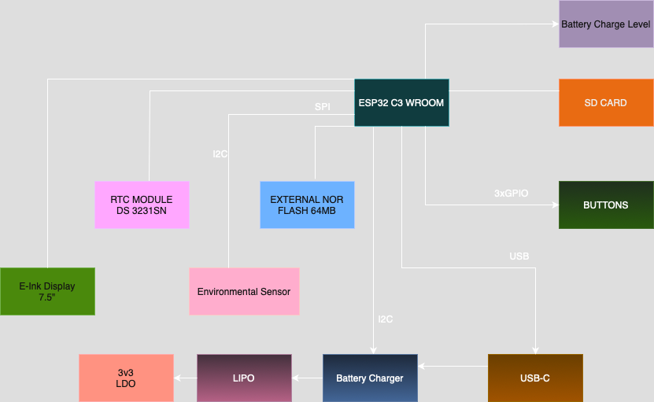

# 📖 OpenBook ESP32-C6 – Hardware Overview & Pin Connections

This document describes the **hardware functionality**, **pin mappings**, and **key components** of the OpenBook e-reader, based on the ESP32-C6-WROOM-1-N8 microcontroller.

## 🛠️ Implementation Steps

1. **Schematic Design** – Created in Eagle with all key modules (ESP32-C6, RTC, BME688, etc.)
2. **2D PCB Layout** – Components placed with routing efficiency in mind
3. **Signal Routing** – Manual routing of SPI, I²C, USB; verified differential pairs
4. **GND Plane** – Full ground pour on both layers for EMI reduction
5. **Power Net Classes** – Separate nets for VBAT, VUSB, and 3V3 with wider traces
6. **Custom Rules** – DRC settings for clearance, trace width, via sizes uploaded
7. **3D Models** – Designed from datasheets for battery, screen, and connectors

## 🧠 Main Controller

### ESP32-C6-WROOM-1-N8
- **Architecture**: RISC-V (Single-Core)
- **Wireless**: Wi-Fi 6, Bluetooth 5 LE
- **Operating Voltage**: 3.3V
- **Interfaces**: SPI, I²C, UART, GPIO, USB

## 💾 Storage & Display

### 📁 SD Card
| Function | GPIO Pin |
|----------|----------|
| CS (SS_SD) | GPIO 4 |
| MOSI | GPIO 7 |
| MISO | GPIO 2 |
| SCK | GPIO 6 |

### 🖼️ E-Paper Display
| Function | GPIO Pin |
|----------|----------|
| CS (EPD_CS) | GPIO 10 |
| DC (EPD_DC) | GPIO 5 |
| RESET | GPIO 23 |
| BUSY | GPIO 3 *(shared with MISO)* |
| MOSI / SCK | *shared with SD* |

### 💾 External NOR Flash (64MB)
| Function | GPIO Pin |
|----------|----------|
| CS (FLASH_CS) | GPIO 12 |
| MOSI / MISO / SCK | *shared with SD* |

## ⏱️ Timekeeping & Sensors

### 🕒 RTC – DS3231SN
| Function | GPIO Pin |
|----------|----------|
| SCL | GPIO 22 |
| SDA | GPIO 21 |
| INT | GPIO 8 |
| 32KHz | GPIO 1 |
| RESET | GPIO 18 |

### 🌡️ Environmental Sensor – BME688
- **Interface**: I²C (shared with RTC)
- **Supply Voltage**: 3.3V

## 🔋 Power Management

### ⚡ Power Supply
- **Input**: USB-C (5V)
- **Output**: 3.3V via LDO regulator
- **Protections**:
  - Reverse polarity diode
  - TVS diodes on USB & SPI lines

### 🔌 Charging Circuit – TP4056
- **Function**: Li-Po battery charging
- **Battery Monitoring**:
  - Gauge via I²C
  - Pins: GPIO 19 (SCL), GPIO 20 (SDA)

## 🔌 Communication & Interfaces

### USB-C Connector
| Function | GPIO Pin |
|----------|----------|
| USB_D+ | GPIO 13 |
| USB_D- | GPIO 12 *(shared with FLASH_CS)* |

### 🔗 Qwiic / Stemma QT Connector
- **Interface**: I²C
- **Usage**: Plug-and-play I²C sensors

## ⏺️ User Inputs
| Button | GPIO Pin |
|--------|----------|
| BOOT | GPIO 9 |
| RESET | connected to EN pin |
| CHANGE | GPIO 23 |

## 🛡️ Protection Features
- TVS diodes on:
  - USB data lines
  - SPI lines (SD, Flash, Display)
- Diode-based reverse polarity protection

## 🧩 Communication Overview

| Peripheral | Interface | GPIO Pins Used |
|------------|-----------|----------------|
| SD Card | SPI | GPIO 2, 4, 6, 7 |
| E-Paper Display | SPI | GPIO 3, 5, 10, 23 |
| External NOR Flash | SPI | GPIO 12, shared MOSI/MISO/SCK |
| RTC + BME688 | I²C | GPIO 1, 8, 18, 21, 22 |
| Battery Gauge | I²C | GPIO 19 (SCL), GPIO 20 (SDA) |
| USB-C Data | USB | GPIO 12 (D-), GPIO 13 (D+) |
| Buttons | GPIO | GPIO 9 (BOOT), GPIO 23 (CHANGE), EN |

## 📌 Complete Pin Assignments

| ESP32-C6 Pin | Function | Connected To | Description |
|--------------|----------|--------------|-------------|
| 3 | RESET | Reset Button | System hardware reset |
| 4 | SS_SD | SD Card (pin 2) | SPI Slave Select for SD card |
| 6 | SCK | SD Card (pin 5) | SPI Clock signal |
| 7 | MOSI | SD Card (pin 3) | SPI Master Out Slave In |
| 8 | INT_RTC | RTC Module (pin 3) | Interrupt signal from RTC |
| 9 | 32KHz | RTC Module (pin 1) | 32KHz clock signal from RTC |
| 13 | USB_D- | USB-C Connector (pin 3) | USB Data Negative line |
| 14 | USB_D+ | USB-C Connector (pin 1) | USB Data Positive line |
| 15 | IO/BOOT | Boot Button | Boot mode selector button |
| 16 | RTC_RST | RTC Module (pin 4) | RTC reset control |
| 17 | I2C_PW | BME688 Sensor | Power control for environmental sensor |
| 19 | SDA | Multiple I²C devices | I²C Serial Data line (shared) |
| 20 | SCL | Multiple I²C devices | I²C Serial Clock line (shared) |
| 23 | IO/CHANGE | Change Button | Display/Mode change button |
| 27 | MISO | SD Card (pin 7) | SPI Master In Slave Out |

## 📦 Bill of Materials (BOM)

| Component | Part Number & Manufacturer | Price |
|-----------|----------------------------|-------|
| ESP32-C6 Module | ESP32-C6-WROOM-1-N8 - Espressif | 4.50€ |
| RTC | DS3231SN - Analog Devices | 8.95€ |
| Environmental Sensor | BME680 - Bosch | 10.50€ |
| External Flash | W25Q512JVEIQ - Winbond | 4.20€ |
| Battery Gauge | MAX17048G+T10 - Analog Devices | 3.80€ |
| USB-C Connector | USB4110-GF-A - GCT | 0.95€ |
| USB Protection | USBLC6-2SC6Y - STMicroelectronics | 0.60€ |
| Charge Controller | MCP73831T-2ACI-OT - Microchip | 0.75€ |
| Voltage Regulators | XC6220A331MR-G - Torex (×2) | 1.25€ each |
| Power MOSFET | DMG2305UX-7 - Diodes Inc | 0.55€ |
| Signal MOSFETs | SI1308EDL-T1-GE3 - Vishay (×2) | 0.45€ each |
| Supercapacitor | CPH3225A - Seiko Instruments | 2.50€ |
| Schottky Diodes | MBR0530 - ON Semiconductor (×3) | 0.40€ each |
| TVS Protection | PGB1010603MR - Littelfuse (×6) | 0.30€ each |
| Other Diodes | SD0805S020S1R0 - KYOCERA-AVX (×2) | 0.30€ each |
| EMI Filter | B72520T0350K062 - EPCOS-TDK | 0.65€ |
| Buttons | EVQP7L01P - Panasonic (×3) | 0.25€ each |
| LED | KP-1608SURCK - Kingbright | 0.15€ |
| Inductor | 744043680 - Wurth Elektronik | 0.85€ |
| IC | BD5229G-TR - ROHM Semiconductor | 1.20€ |
| Various Capacitors | CC0402MRX5R5BB106 - YAGEO | 0.10€ each |
| Various Resistors | RC0402FR-07100KL - YAGEO | 0.01€ each |
| Test Points | Test Points PCB (×17) | 0.02€ each |
| Solder Jumpers | Solder Jumpers | 0.05€ |
| Qwiic Connector | Store Comet SRL | 0.35€ |
| SD Card Slot | Model Link - DigiKey | 1.05€ |

# Circuit Block Diagram

